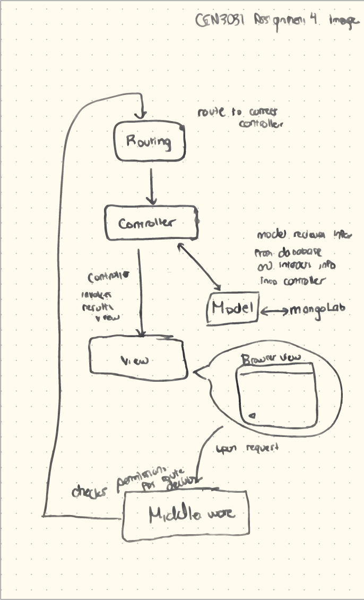
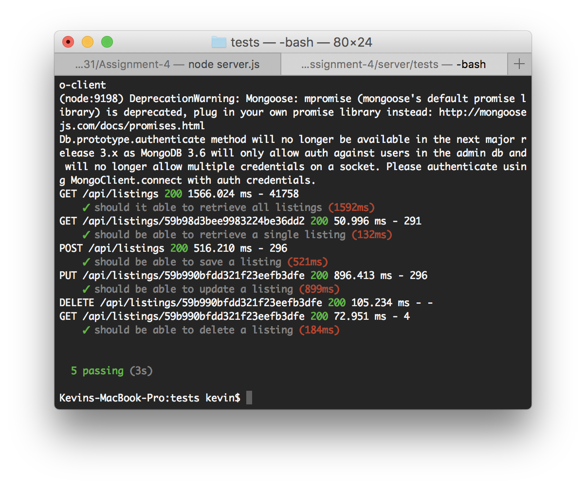
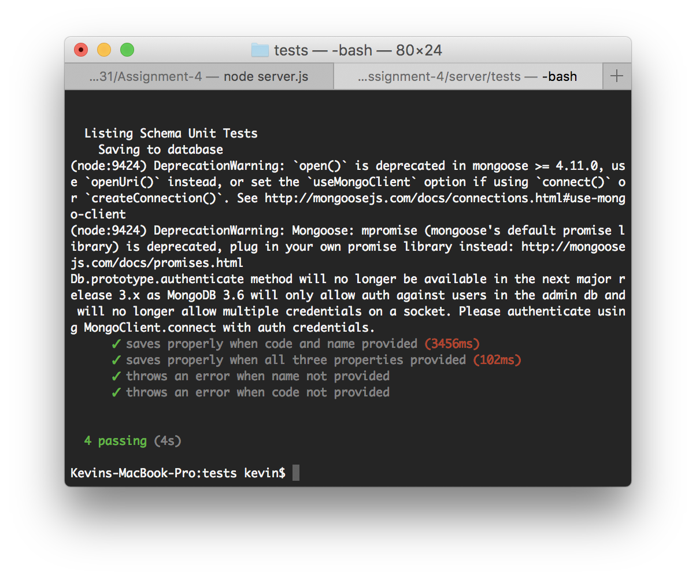

# Creating a server-side CRUD module using Express

### Part 1
Create a diagram of how the different parts of the server interact with one another. Specifially make note of: 
   - what is defined in the controllers
   - how the router makes use of the controllers to determine the flow of request handling
   - how middleware is used throughout the application to modularize the code

### Part 2

1. Implement the request handlers in `listings.server.controller.js`
    - test your implementation by running the tests found in `listings.server.routes.test.js`
2. Complete the app configuration in `express.js`. 
    - serve the static files found in the public folder when a user makes a request to the path `/`. [Refer to this documentation](http://expressjs.com/en/starter/static-files.html) for help
    - use the listings router for requests going to the `/api/listings` path 
    - direct users to the client side `index.html` file for requests to any other path
3. Make sure your server is functioning correctly by starting it up by running the command `node server.js`

### Images

